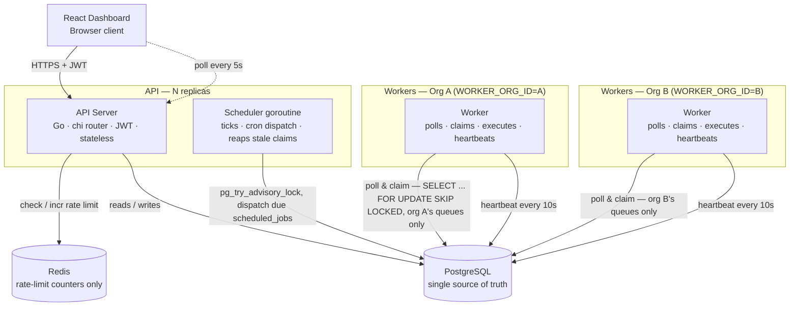

# Architecture

Two Go binaries, and everything they need to agree on lives in one place:
PostgreSQL. No message broker, no external queue sitting between them.

No message broker, no external queue — Postgres is what every piece
agrees through. Redis is a soft cache for rate limits, not required for
correctness (see below). Two example org worker fleets are shown because
that's the part that's easy to miss: a worker belongs to exactly one
organization and only ever sees that org's queues — "add more workers" always
means "for a specific org," never a global capacity dial. See
[design-decisions.md](design-decisions.md#workers-belong-to-exactly-one-organization).

## What each piece actually does

**`cmd/api`** is the REST server — auth, project/queue/job CRUD, the data
the dashboard reads. It's stateless, so it scales behind a load balancer
with no coordination needed between replicas. CORS is locked down to
`CORS_ALLOWED_ORIGINS` rather than left wide open.

**The scheduler** isn't a separate service — it's a goroutine running
inside every `cmd/api` replica. It wakes up every `SCHEDULER_TICK_SEC`
seconds, grabs a Postgres advisory lock first, and only does real work if
it gets the lock. That's what stops a cron job from firing three times just
because you happen to be running three API replicas. The same tick also
reaps jobs stuck in `claimed` or `running` whose worker has gone quiet.

**`cmd/worker`** is the other binary. Each instance is started with a
required `WORKER_ORG_ID` and only polls that organization's non-paused
queues, claims the next runnable job atomically, runs it, and sends
heartbeats while it works. On `SIGTERM` it stops picking up new jobs but
lets whatever's already running finish before it exits.

**PostgreSQL** is the only piece of this system that actually has to stay
up for correctness — claiming, concurrency limits, retries, the advisory
lock, all of it lives here. Why that's the design instead of a dedicated
queue is explained in [design-decisions.md](design-decisions.md).

**Redis** does one job: cross-replica rate-limit counters. If it goes down,
the rate limiter just lets requests through instead of taking the API down
with it — losing a soft limit for a while beats an outage.

## Job lifecycle

The schema behind these states is in [er-diagram.md](er-diagram.md); the
REST endpoints that drive them are in [api.md](api.md).
