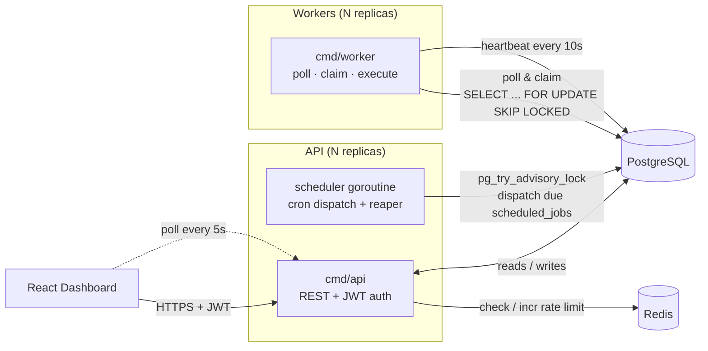
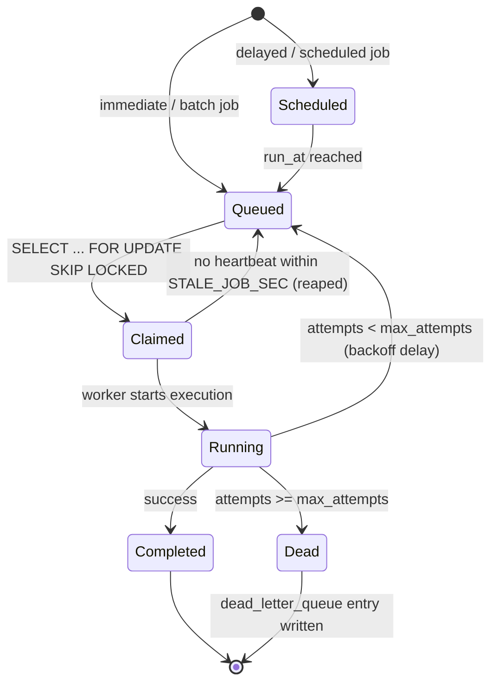

# Architecture

Two independent Go binaries, coordinating entirely through PostgreSQL —
no message broker, no external queue.

## Components

- **`cmd/api`** — stateless REST server: auth, project/queue/job CRUD, dashboard
  reads. Scales horizontally behind a load balancer; any replica can serve any
  request. CORS is locked to `CORS_ALLOWED_ORIGINS` (the dashboard's own
  origin by default) rather than left open.
- **scheduler** — a goroutine inside every `cmd/api` replica. Ticks every
  `SCHEDULER_TICK_SEC` seconds, but calls `pg_try_advisory_lock` first — only
  one replica's tick does work per cycle, so a cron job never fires twice just
  because you scaled the API out. The same tick reaps jobs stuck in
  `claimed`/`running` whose worker has gone quiet.
- **`cmd/worker`** — polls every unpaused queue, atomically claims the next
  runnable job, executes it, sends heartbeats, and on `SIGTERM` stops claiming
  new work but lets in-flight jobs finish before exiting.
- **PostgreSQL** — the only stateful dependency for correctness. Job claiming,
  concurrency limits, retries, and the advisory lock all live here — see
  [design-decisions.md](design-decisions.md) for why.
- **Redis** — purely for cross-replica rate-limit counters. If it's
  unreachable the rate limiter fails open (allows the request) rather than
  taking the API down over a non-critical dependency.

## Job lifecycle

See [er-diagram.md](er-diagram.md) for the schema behind these states and
[api.md](api.md) for the REST surface that drives them.
