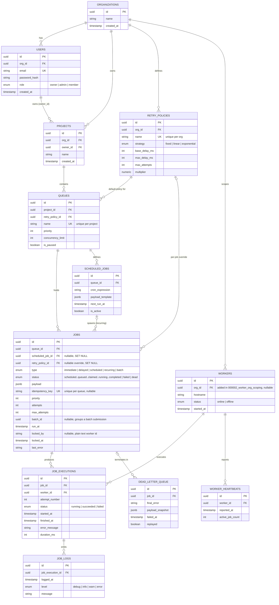

# Entity-Relationship Diagram

Twelve tables, matching the brief exactly: Users, Organizations, Projects,
Queues, Jobs, Job Executions, Retry Policies, Workers, Worker Heartbeats,
Job Logs, Scheduled Jobs, Dead Letter Queue.

Full DDL, if you want the exact constraints and defaults:
[`migrations/000001_init_schema.up.sql`](../migrations/000001_init_schema.up.sql)
and [`migrations/000002_worker_org_scoping.up.sql`](../migrations/000002_worker_org_scoping.up.sql).

## A few things worth knowing about this schema

Every table uses a `uuid` primary key from `gen_random_uuid()` instead of a
serial integer — mainly so IDs are safe to hand back in API responses
without leaking how many rows exist.

It's normalized to 3NF throughout, and the clearest example is
`retry_policies` being its own table instead of a few columns bolted onto
`queues`. A policy needs to be reusable across queues, and a single job
occasionally needs to override its queue's default — neither of those work
if the policy is just inline columns. `jobs.retry_policy_id` is nullable
for exactly this reason: unset, it falls back to whatever `queues.retry_policy_id`
says.

`job_executions` and `job_logs` are append-only. A job's own row gets
overwritten every time it retries, but each *attempt* keeps its own row —
otherwise there'd be no way to look back and see what actually happened on
attempt 2 once attempt 3 has already started.

### `workers.org_id` is nullable — the one intentional exception

Every other FK in this schema is `NOT NULL`. `workers.org_id` is the
exception: it was added by a later migration
(`000002_worker_org_scoping`), and existing worker rows from before that
migration have no organization they can be correctly backfilled to.
Deleting them instead of leaving them null would have cascade-deleted their
`job_executions` and `job_logs` history along with them. They simply stop
matching any org-scoped query going forward — equivalent to being retired,
not deleted. Every worker row the application creates going forward always
sets it; see [design-decisions.md](design-decisions.md#workers-belong-to-exactly-one-organization).

### The indexes that actually matter

Most of the FK columns have an obvious supporting index and aren't worth
listing individually. A few carry real weight on the write path, though:

- `jobs(queue_id, status, priority DESC, run_at)` — this is the index the
  atomic-claim query runs on. Without it, claiming a job means scanning the
  whole table.
- `UNIQUE (queue_id, idempotency_key) WHERE idempotency_key IS NOT NULL` —
  idempotent submission isn't just an application-layer promise, the
  database physically won't allow a duplicate.
- `worker_heartbeats(worker_id, reported_at DESC)` — "is this worker still
  alive" is always a query for the single most recent row, so that's what
  the index is shaped for.
- `scheduled_jobs(next_run_at) WHERE is_active` — a partial index, since the
  scheduler only ever cares about active, due rows and there's no reason to
  index the rest.
- `workers(org_id)` — every worker-facing endpoint and the dashboard's
  online-worker count filter by it.

### What happens when something gets deleted

Most deletes cascade down the natural containment tree:
`organizations → projects → queues → jobs → job_executions → job_logs`,
plus `dead_letter_queue` and `worker_heartbeats` cascading with their
parent row. That's the right default here — an execution log with no job
to belong to isn't useful to anyone. The trade-off is that deleting a
project takes its whole audit history with it, which is fine for this
brief but flagged in [design-decisions.md](design-decisions.md) as the
first thing to change (to a `deleted_at` soft-delete) if this ever needed
to hold onto records for compliance reasons.

Three foreign keys deliberately don't follow that pattern:

- `queues.retry_policy_id → retry_policies` is `RESTRICT` — you can't
  delete a policy while a queue is still using it.
- `projects.owner_id → users` is `RESTRICT` — same idea, you can't delete a
  user who still owns a project.
- `jobs.scheduled_job_id` and `jobs.retry_policy_id` (the per-job override)
  are both `SET NULL` — a job that's already running should keep running
  even if the cron definition or the policy override behind it gets
  deleted later.
