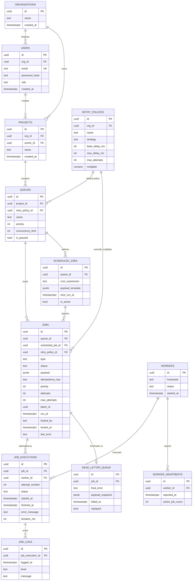

# Entity-Relationship Diagram

All twelve entities the brief names: Users, Organizations, Projects, Queues,
Jobs, Job Executions, Retry Policies, Workers, Worker Heartbeats, Job Logs,
Scheduled Jobs, Dead Letter Queue.

## Keys, indexes, cascades

Full DDL: [`migrations/000001_init_schema.up.sql`](../migrations/000001_init_schema.up.sql).

- Every table uses a `uuid` surrogate primary key (`gen_random_uuid()`) — safe
  to expose in the API, doesn't leak row counts.
- **3NF throughout.** `retry_policies` is its own table, not columns on
  `queues`, because a policy is reusable across queues and a job can override
  its queue's default (`jobs.retry_policy_id` is nullable — falls back to
  `queues.retry_policy_id` when unset).
- `job_executions` and `job_logs` are append-only — a job's own row is
  overwritten on every retry, but each attempt keeps its own execution row,
  so retry history stays a real audit trail.
- **Indexes that carry the write path:**
  - `jobs(queue_id, status, priority DESC, run_at)` — covers the atomic-claim
    query with no sequential scan.
  - `UNIQUE (queue_id, idempotency_key) WHERE idempotency_key IS NOT NULL` —
    idempotent job submission enforced at the database, not just in code.
  - `worker_heartbeats(worker_id, reported_at DESC)` — "is this worker alive"
    is always a most-recent-row lookup.
  - `scheduled_jobs(next_run_at) WHERE is_active` — partial index; the
    scheduler only ever scans active, due rows.
- **Cascades** run down the containment tree —
  `organizations → projects → queues → jobs → job_executions → job_logs` — an
  orphaned execution log with no parent job is meaningless.
  `dead_letter_queue` cascades with its job too. Trade-off: deleting a
  project destroys its audit history; noted in
  [design-decisions.md](design-decisions.md) as the first thing to swap for a
  `deleted_at` soft-delete in a compliance-sensitive deployment.
